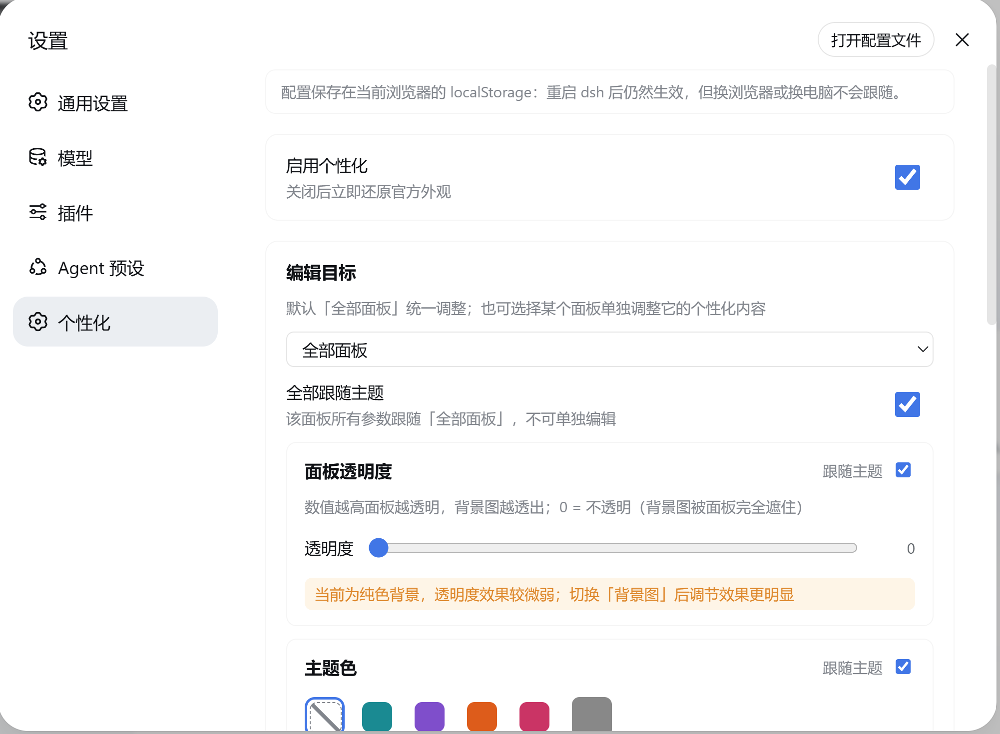
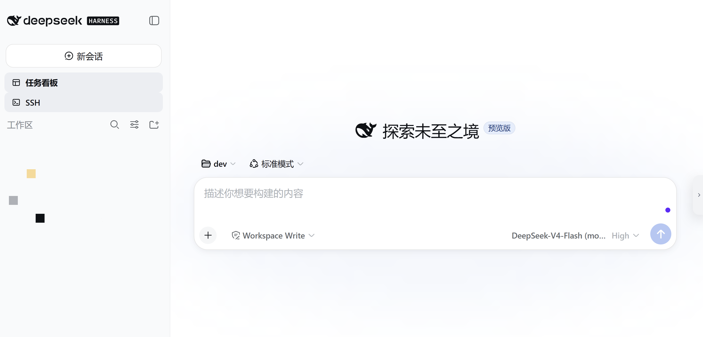
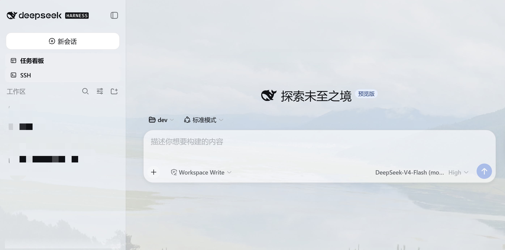
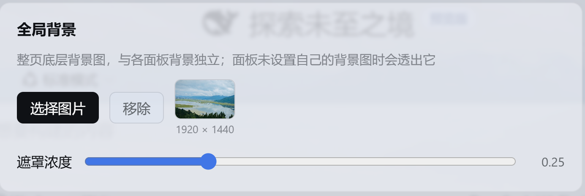

# dsh-web-visualuiconfig — DSH Web GUI visual configuration plugin

English | [中文](README.zh.md)

A standalone, hot-pluggable DeepSeek Harness (DSH) Web GUI plugin that layers switchable visual configuration over the official look — backgrounds, scrim, translucent panels, accent palettes, fonts, scrollbars, selection color, favicon and page title. Styling runs browser-side; the configuration persists (by default) to a machine file under `~/.dsh` served back through the plugin's own `/personalization/*` routes, with a browser-only fallback. The plugin mounts only through `cordis.patch.yml` and the profile mechanism, without modifying DSH source.



## Capabilities

| Capability | Description |
| --- | --- |
| Background settings | Every panel (unified between the "all panels" and single-panel targets) has its own background group: **solid color** (default — the panel shows its base color, transparency still applies) or **image** (rendered at the panel's layer, scrim adjustable, **fit: cover / contain / stretch / tile**). The "all panels" upload is a **source bridge**: it only compresses, never crops — each panel crops via `background-size: cover` at render time and shows it only while its background knob follows the baseline (panels with an independent background get a hint) |
| Global background | A page-level group outside the edit target: a page-wide **bottom-layer** backdrop (rendered on body), independent of panel backgrounds — panels without their own image show it through, panels with their own image cover it. Supports **fit** (cover/contain/stretch/tile) and **blur** (0–60px, applied as `filter` on the standalone fixed backdrop layer — never a column, so it traps no fixed overlays) |
| Panel transparency | 0–0.9 slider: 0 = official opaque (the backdrop is fully covered), right = more transparent and the backdrop shows through; floating layers (menu/dialog/input) stay more opaque for readability. No `backdrop-filter`: blur on the official frame columns traps fixed overlays (the settings modal etc.), a boundary the dsh-web-ui skin system documents |
| Accent palette | 4 built-in global theme presets (Ocean / Violet / Ember / Rose) plus a custom hex accent (`color-mix` derives the full ramp), overriding `--dsw-static-deepseek-*` and the aionui panel's `--aion-*` tokens; light/dark auto-adapt. The 21 deepseek-harness-skin palettes and 4 Catppuccin flavors are kept as **internal colour art assets** (`SKIN_PRESET_ASSETS` / `CATPPUCCIN_PRESET_ASSETS` in `src/shared/presets.ts`), not exposed to users |
| Typography | Rounded / Serif / Mono presets, or a custom `font-family` stack |
| Scrollbar | Rounded scrollbar, light/dark palettes |
| Selection color | Custom `::selection` background |
| Page chrome | Favicon (≤128px), page-title override, and a **running status text** (replaces the official "Deep diving...", injected into `[role="status"]` via a DOM observer; clearing restores the official label) |
| Panel-level personalization | Runtime detection of present panels; the "edit target" selector defaults to "all panels", editing the baseline appearance that every follow knob inherits from. Every module (transparency / palette / font / scrollbar / selection / background) carries a "follow theme" switch — a single-panel view flips that panel's knob, the "all panels" view flips every panel's knob at once — plus a "follow all" master switch in both views. Current panels: sidebar, conversation, details, right file/preview panel (aionui), task board, SSH panel |
| Config storage | A "Config storage" section chooses where settings live: **follow this machine** (default — persisted to `~/.dsh/dsh-web-personalization.json` through the host half, so they survive restarts *and* follow you to another browser) or **this browser only** (the original `localStorage` behavior). Images are stored as files under `~/.dsh/personalization/` and served as short same-origin URLs, so they escape the `localStorage` quota and the 2 MB CSS `url()` limit |
| Character themes | Give an anime character art image + a short introduction; the agent reads the art, derives the look (accent/preset/font/transparency/scrollbar/selection/background/title) and applies it, producing a GUI that matches the character. Themes are saved in a library (`themes`) with list/switch/deactivate/remove; deactivating restores the pre-theme official look |

## Screenshots

Background-image effect (before / after):

| Before | After |
| --- | --- |
|  |  |

Uploading a background in the settings page:



## Install

Link the local source for development, then **restart `dsh web`** — the settings panel gains a "Personalization" page.

```sh
### 从本地源码安装（开发调试）
dsh plugin --profile web add link:C:/path/to/dsh-web-visualuiconfig
```

### Install via the DSH agent

No terminal needed: in a DSH conversation, just ask the agent to install the plugin for you — it clones the repository, mounts it into the web profile with a `link:` entry, and reminds you to restart `dsh web`:

> Please install the dsh-web-visualuiconfig plugin.

The agent runs the equivalent of:

```sh
git clone https://github.com/Foo1Moon/dsh-web-visualuiconfig.git
dsh plugin --profile web add link:<cloned repo path>
```

## Configuration storage

The config defaults to **follow this machine**: the host half persists it to `~/.dsh/dsh-web-personalization.json` (images as files under `~/.dsh/personalization/`) and serves it to every browser through the `/personalization/*` routes — the settings survive a `dsh web` restart and follow you to another browser or machine. The settings page's "Config storage" section can switch to **this browser only**, which keeps the original `localStorage` behavior (`dsh.personalization.v1` is still written as a cache either way). The browser half degrades gracefully to browser-only persistence while the host half is unavailable (e.g. before a restart after upgrading).

This needs no `~/.dsh/settings.yaml` change and is not affected by the `dsh-host-apiproxy` `WEB_SETTINGS_NAMESPACES` whitelist — the plugin owns its file and its routes.

Uninstalling the plugin leaves the config file and asset directory behind (deleting them on plugin dispose would also wipe them on every `dsh web` restart). To clean up, either delete `~/.dsh/dsh-web-personalization.json` and `~/.dsh/personalization/` manually, or call `POST /personalization/uninstall`.

## Programmatic control

Four ways to drive the settings without the GUI (every change is broadcast to all open tabs over SSE):

- **Agent tool** — the model can change the theme from natural language ("make the accent warm orange", "set this background image"): it sees a `personalization` tool with structured arguments (`accent`, `preset`, `transparency`, `font`, `storage`, `backgroundImage`, `removeBackground`, `enabled`, `reset`) and applies the change immediately. Character themes go through the `character_theme` (apply/create) and `character_theme_manage` (list/switch/deactivate/remove) tools — see the next section.
- **HTTP** — the full surface: `GET|PUT|PATCH /personalization/config`, `POST /personalization/reset`, `PUT /personalization/assets` (raw image bytes, `Content-Type: image/jpeg|png|webp|gif`). `PATCH` deep-merges a partial update, so an agent or script only sends what changed:
  ```sh
  curl -X PATCH -H 'content-type: application/json' \
    -d '{"base":{"palette":{"accent":"#ff8800"}}}' \
    http://127.0.0.1:3080/personalization/config
  ```
- **Command** — `/personalization` in the chat input (no model round-trip): `show`, `set accent #hex`, `set preset ocean|violet|ember|rose`, `set glass 0-0.9`, `set font default|rounded|serif|mono`, `set storage host|browser`, `background set <local image path>`, `background remove`, `reset`.
- **Service** — other plugins `inject: ['personalization']` to call `read()`, `update(patch)`, `reset()`, `onUpdated(cb)`.

## Character themes

Give an anime character art image + a short introduction and the GUI takes the character's style:

> Build a "Frieren" theme from this image: `C:\pics\frieren.png`. She is a thousand-year-old elf mage — gentle, long-lived, understated.

The agent follows a **two-phase confirm-before-apply protocol**:

1. reads the art with `read_image` and the introduction with `read` (**requires an image-capable model**);
2. **Phase 1 — propose (nothing is applied)**: derives **2–3 candidate schemes**, each with a different hook into the character (hair / eyes / outfit …). Every candidate presents its **four palette seeds** (accent: that hook's color as a hex, keeping panel contrast; secondary: a second voice; surface: the page background; text: the text anchor), the scheme (light/dark, which pins the UI while the theme is active), font from personality (cute/soft → `rounded`, elegant/classical → `serif`, cool/tech → `mono`), transparency/scrim from the mood, whether scrollbar/selection follow the palette, and a one-line vibe summary; **by default the art is *not* used as a backdrop** (a full-bleed character image hurts readability; pass `background` explicitly), and the page title becomes the character name. The agent asks which candidate the user prefers;
3. **Phase 2 — discuss and iterate**: the proposal is revised from feedback (too dark / too pink / too rounded …) until the user is satisfied — `character_theme` is **never called before an explicit confirmation**, so the UI is untouched during the discussion;
4. **Phase 3 — apply**: only after the user confirms, calls `character_theme` (**seeds are preferred over a bare accent** — the engine derives the whole contrast-preserving ramp from them) to apply and save the theme, and `character_theme_manage` to list / switch / deactivate / remove. Fine-tuning or deactivation are offered as follow-ups.

**Shortcut**: when the user explicitly says to skip the discussion ("直接做吧", "you decide"), the agent applies a single recommended scheme directly. The settings page's local extraction wizard follows the same rule: it shows the extracted scheme as a preview and applies only on the user's confirmation.

**The engine works on the skin discipline**: the four seeds go through `deriveSkin` (OKLab, ported from deepseek-harness-skin) into the full 73-step `--dsw-static-*` ramp (neutral steps reproduce upstream's contrast ratios, accent steps pin the seed), all rules live under the `html body[data-dsh-personal]` attribute scope, and no layout-structure rules are written; the page-wide backdrop rides an independent fixed layer instead of body inline styles. A **readability contract** (body 4.5 / outline 3 / button text 4.5, …) is audited during derivation, so illegible model-chosen colors are corrected by construction.

Semantics:

- **At most one theme is effective at a time**: switching A→B replaces A's look entirely; deactivating restores the pre-theme official look (the theme stays in the library).
- **Re-applying the same name replaces** the theme (patch updated and re-activated).
- Theme art reuses the sha256 asset store (`sourceImage`); deleting a theme garbage-collects its art.
- Activation bakes the overlay into `base`/`panels`/`globalBackground`/`chrome` — the engine applies it directly, and the settings page shows the effective values.
- The settings page's **Personalization → Character themes** section lists every saved theme (thumbnail + introduction) with Apply / Turn off / Delete buttons — fully equivalent to `character_theme_manage` in chat (same `themes` document).

## Relationship with the skin system

This plugin coexists with `dsh-skins` skins (e.g. Blue Fantasy): a skin restyles the whole site (background included), this plugin is a visual-configuration overlay — both work through **attribute-scoped CSS** (this plugin's `html body[data-dsh-personal]` scope outranks a skin's `body[data-dsh-<skin>]` at equal specificity), with no body inline styles. When both are enabled, the higher-specificity/later writer wins. Turning off the plugin's "Enable personalization" master switch restores the official look completely.

## Development

```sh
pnpm install
pnpm build:stock -- --harness <deepseek-harness-root>  # regenerate stock.generated.ts (re-run after a DSH upgrade)
pnpm build      # produces lib/index.js (host half) and lib/client.js (browser bundle)
pnpm watch      # incremental build
pnpm typecheck  # tsc --noEmit
pnpm test       # node:test + tsx (no vitest dependency)
```

Structure:

```
src/index.ts                    # host half: mounts store + asset store + routes (webServer service)
src/host/store.ts               # ~/.dsh/dsh-web-personalization.json: atomic writes, corrupt backup, revision
src/host/assets.ts              # image files under ~/.dsh/personalization/: sha256 naming, whitelist, GC
src/host/routes.ts              # /personalization/* routes, SSE revision channel, uninstall cleanup
src/host/commands.ts            # /personalization command (registered lazily via ctx.inject)
src/host/tool.ts                # personalization agent tool (registered lazily via ctx.inject)
src/host/character-tool.ts      # character_theme / character_theme_manage tools + derivation guidance
src/host/patch.ts               # deepMerge for partial config updates (re-exports the shared impl)
src/host/types.ts               # minimal type bridges for webServer/commands/personalization services
src/shared/config.ts            # config model + sanitize + storageMode + asset refs + theme/seeds types
src/shared/presets.ts           # preset catalog (4 built-in global themes) + skin/Catppuccin colour art assets
src/shared/theme.ts             # theme library logic: activate/switch/deactivate/remove/snapshot/patch
src/shared/patch.ts             # deepMerge (environment-agnostic, inlined into both bundles)
src/shared/color.ts             # OKLab/OKLCh colour math (ported from deepseek-harness-skin, MIT)
src/shared/derive.ts            # 4 seeds → full --dsw-* ramp derivation + readability-contract audit
src/shared/extract.ts           # pixel extraction (histogram → 4 seeds + scheme + extremes) + veil tuning
src/shared/render.ts            # derived skin → attribute-scoped CSS text
src/shared/stock.ts             # upstream palette data types (StockStep/StockData)
src/shared/stock.generated.ts   # generated data: 73-step palette + 89 semantic aliases (build-stock.mjs)
src/client/index.ts             # browser half: registers the settings page, wires engine + host sync (SSE)
src/client/engine.ts            # effect engine: attribute-scoped derived palette / fixed backdrop layer / fonts / chrome
src/client/status-injector.ts   # running status text: MutationObserver rewrites [role="status"] (official Deep diving...)
src/client/settings.ts          # localStorage cache over the shared model (legacy migration in shared/config.ts)
src/client/host.ts              # browser → host transport (fetch wrappers)
src/client/PersonalizationSection.tsx  # settings page component
src/client/image.ts             # image compression (canvas → JPEG data URL)
src/client/locales.ts           # zh / en copy
```

## Known limitations

- In "this browser only" mode, persistence is browser-local and the `localStorage` quota (≈5 MB) bounds how many large backdrop images can be kept. In the default host mode, images live on disk and the quota does not apply.
- Backdrop images render through short `blob:` URLs (data URLs) or direct host URLs (`asset:` refs): Chromium's CSS parser silently drops `url()` values longer than 2 MB, so the engine decodes stored data URLs into Blobs at apply time. Host-stored assets are short same-origin URLs and are exempt from this limit.
- The host half needs a `dsh web` restart after install/upgrade; until then the browser half transparently falls back to browser-only storage.
- The character-theme chat flow **depends on an image-capable model** (`read_image`): on a model without image input the tool errors with a hint to switch models. The settings page's **"Generate from image" wizard** is the model-free fallback (browser-local palette extraction + contrast-preserving derivation, `src/client/character-wizard.ts`).
- Manual knob edits made while a theme is active are **not saved with the theme**: deactivating or switching away restores the appearance from the moment the theme was activated.
- A theme that pins its scheme rewrites the `data-ds-dark-theme` attribute: toggling the app's light/dark preference while such a theme is active may be overridden until the theme is re-applied or turned off.
- There is no host first-paint injection (`tapIndex`) for a plugin: the theme applies once the plugin loads, so the first frame may flash briefly.
- **Diagnostics log**: on every apply the browser engine reports the applied knobs (palette/glass/font/backdrop/scheme pin), the emitted CSS, and live layout measurements to `~/.dsh/personalization-diagnostics.jsonl` (`POST /personalization/diagnostics`, throttled, last 40 entries kept). Reproduce a layout bug and hand that file to the agent for diagnosis.
- `stock.generated.ts` is pinned to the harness's `design-platform.css`: after a DSH upgrade re-run `pnpm build:stock -- --harness <root>` (`--check` verifies drift).
- The "edit target" panel list is detected once when the settings page mounts: the aionui right panel appears only after a project session opens, so reopen the settings page to select it.
- Panel transparency is most visible with an image background; on a solid panel the effect is subtle (the page hints at this).
- When a skin and this plugin are both enabled, the later writer wins; turn off the master switch to fully restore the official look.

## License

MIT. Do not package art assets you do not have the rights to.
